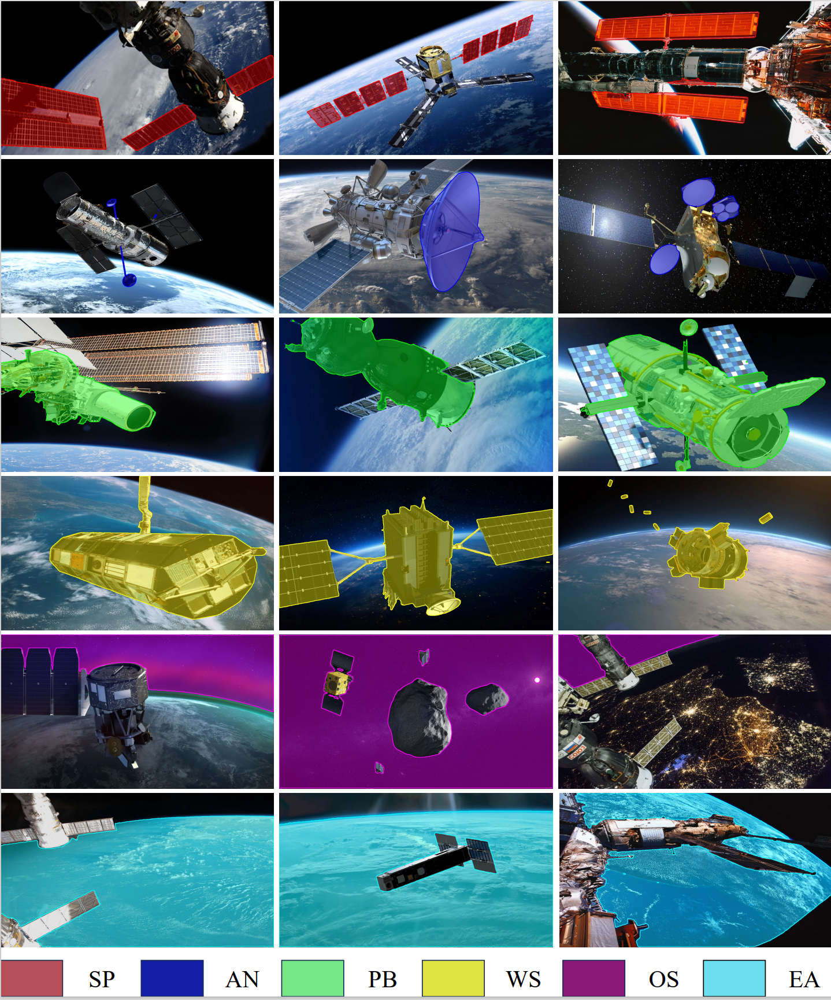
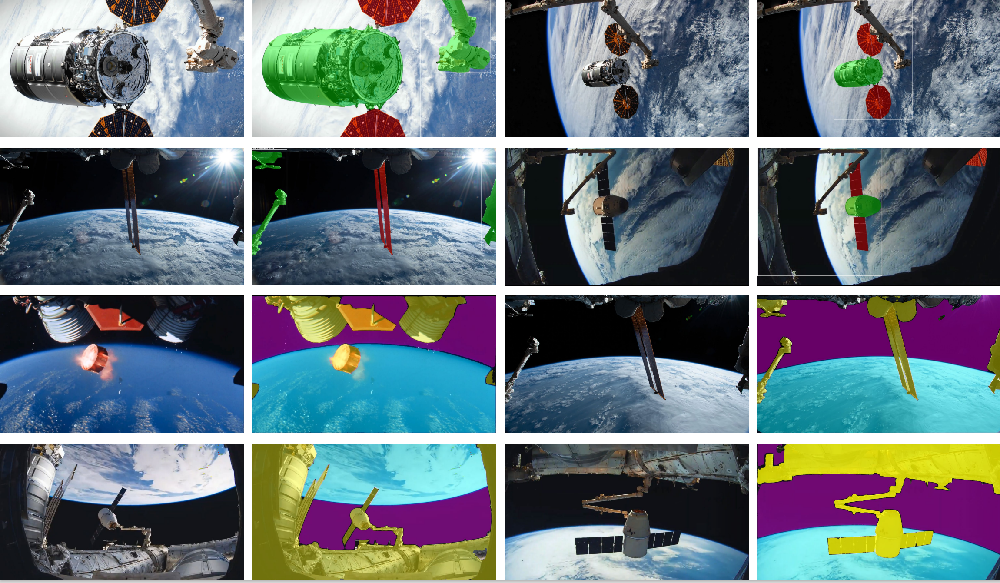

# SpaceTarget-InstanceSegmentation-Dataset

This repository provides the code and dataset for running space target inference using the Segment Anything Model (SAM) and Object Detection Prompt. The included resources support high-quality and accurate instance segmentation, expanding beyond pose estimation tasks to include instance segmentation for space target images.

We will continuously release our automatic annotation code and space target instance segmentation datasets. Stay tuned for updates.

## Experiment Results

Below are some examples of the experiment results:

